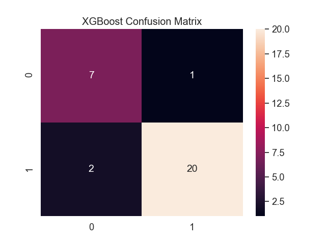
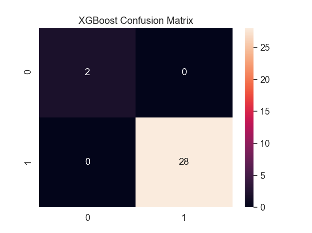

# parkinsons_detection
Parkinson's detector using a public dataset containing speech data from patients with Parkinson's. This dataset also contains data from healthy participants. 

## Learnng Curves (100 iterations)
")

## Confusion Matrix (Confusion Matrix, 100 itr., 0=healthy, 1=parkinsons):

## Learnng Curves (500 iterations)
")

## Confusion Matrix (Confusion Matrix, 500 itr., 0=healthy, 1=parkinsons):
