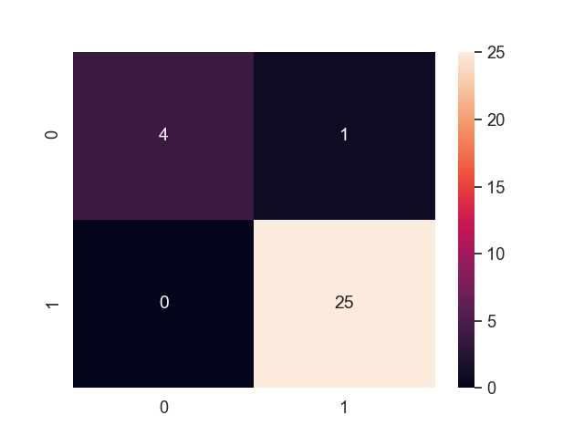

# parkinsons_detection
Parkinson's detector using a public dataset containing speech data from patients with Parkinson's. This dataset also contains data from healthy participants. 

## Confusion Matrix (96% Accuracy, 0=healthy, 1=parkinsons):
